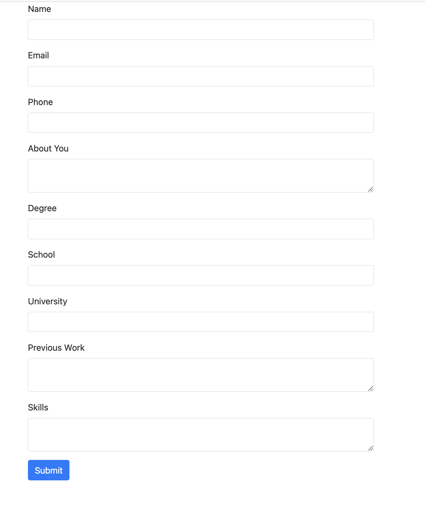
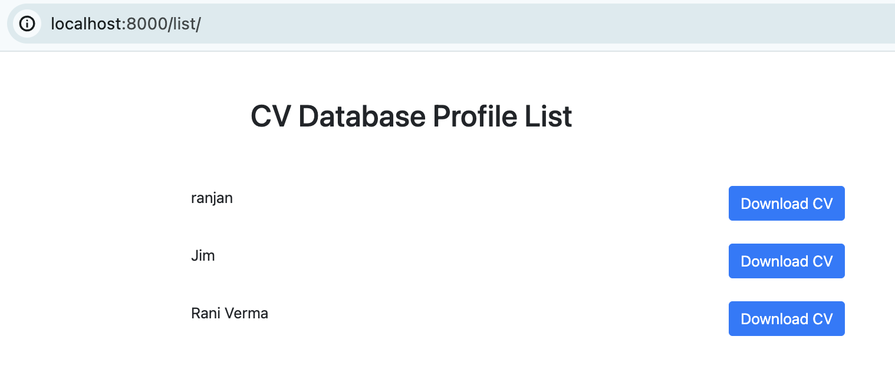
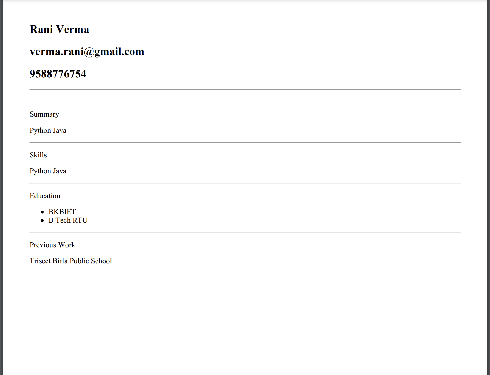

# Simple_CV_Generator_django

This is a simple CV Generator which uses the information of user and provides CV in pdf format.

In this project we have used some of the useful modules such as Html to Pdf converter and pdf kit through which we can convert the html page to the pdf and download it.

## Home Page

## Download(through Link)

## CV(in pdf)

